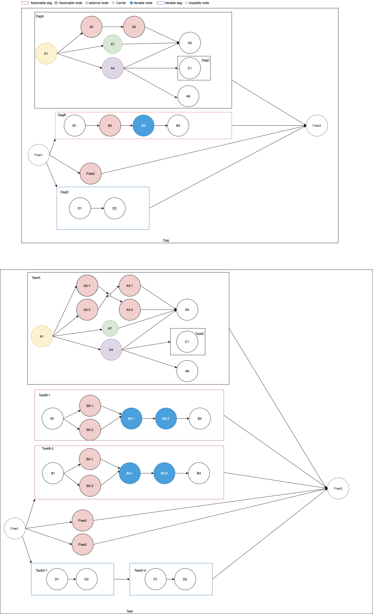

# seaflow
The most free process choreographer

<a href="https://rainware.github.io/blogs/project%20documents/2022/07/22/seaflow-guide.html">Seaflow Guide</a>

# Install
```language=bash
pip install seaflow
```

# Example

Download seaflow examples
```language=bash
git clone https://github.com/rainware/seaflow.git
```
```language=bash
cd seaflow/examples
```

#### preparation

* mysql
* redis

```language=python
# settings.py
"""
Django settings for coe project.

Generated by 'django-admin startproject' using Django 2.2.6.

For more information on this file, see
https://docs.djangoproject.com/en/2.2/topics/settings/

For the full list of settings and their values, see
https://docs.djangoproject.com/en/2.2/ref/settings/
"""

INSTALLED_APPS = [
    'seaflow'
]

DATABASES = {
    'default': {
        'ENGINE': 'django.db.backends.mysql',
        'NAME': 'test',
        'USER': 'root',
        'PASSWORD': '',
        'HOST': '127.0.0.1',
        'PORT': '3306',
        'OPTIONS': {'charset': 'utf8mb4'}
    },
}

# Celery
CELERY_ACCEPT_CONTENT = ['json']
CELERY_RESULT_SERIALIZER = 'json'
CELERY_TASK_SERIALIZER = 'json'
CELERY_BROKER_URL = 'redis://127.0.0.1:6379/6'
CELERY_RESULT_BACKEND = 'redis://127.0.0.1:6379/6'
```

#### 1. setup db
```language=bash
python setup_db.py
```

#### 2. load actions and dags
```language=bash
python load_actions.py
```
```language=bash
python load_dags.py
```

#### 3. start celery worker
```language=bash
celery -A main worker --concurrency=3 -E -l info
```

#### 4. run tasks
```
python run_tasks.py
```

#### Demo dag and task

