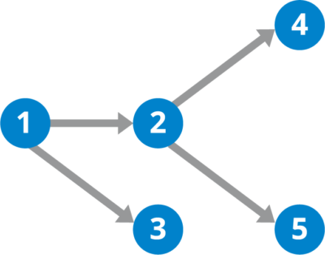
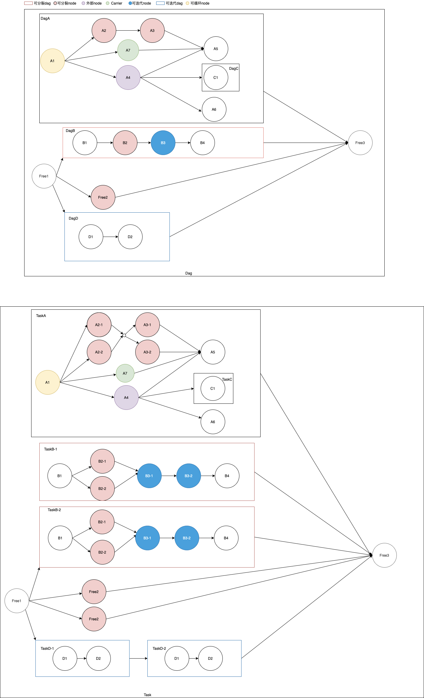
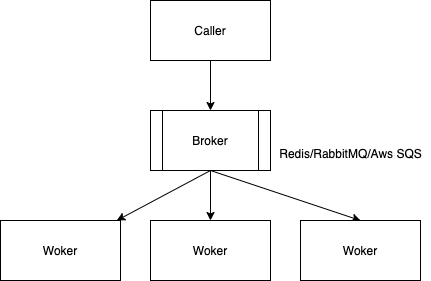
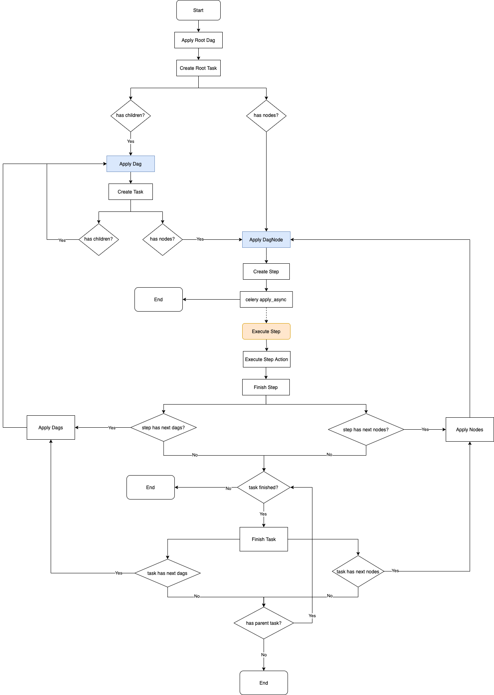

# 1. 概述
Seaflow是一个基于DAG的工作流调度引擎，旨在进行最自由的任务编排。思路来自于河流(Riverflow)，DAG就是设定的河道，水流入之后就会沿着河道流动，任意的分叉或汇合。
> DAG: 有向无环图




名词:
* DAG: 有向无环图，工作流定义
 * Root Dag
 * Sub Dag: 组成Root Dag的子Dag
* Node: 工作流节点，工作流定义的组成部分
* Action: Node上绑定的操作，也就是任务执行时要执行的操作
* Task: 任务，一个DAG的执行会产生Task
  * Root Task:
  * Sub Task: 执行子Dag产生的子任务
* Step: 步骤，任务的组成部分，Node的执行会产生Step


# 2. 特性
1. Json DSL定义
  * 流程定义
  * Action输入/输出参数定义及校验
  * Dag和Node的输入/输出参数适配
  * Json Logic
2. 任务嵌套与复用
3. map/fission/分裂:
  * 对输入参数中某一个数组类型的字段进行map，根据数组长度分裂出对应个数的子任务或者子步骤。
  * 将多个子任务或子步骤的输出进行merge作为最终输出。
4. reduce/iter/迭代:
  * 对输入参数中某一个数组类型的字段进行迭代，根据数组长度迭代出对应个数的子任务或者子步骤。
  * 也可以基于JsonLogic设置的持续条件进行迭代，直到不再满足迭代条件为止。
  * 每次迭代的输出将作为下一次迭代的输入，以最后一次迭代的输出作为最终输出。
5. loop/循环:
  * 基于JsonLogic的持续条件进行循环，直到不再满足循环为止。
  * 循环不会产生新的子任务或者子步骤。
  * 以最后一次循环的输出作为最终输出。
  * 执行优先级：分裂 --> 迭代 --> 循环
6. callback/回调: 任务执行时可以传入callback配置参数，Root Task/Sub Task/Step的都可以设置callback，在状态发生改变时将会通过callback进行通知。
7. 内部和外部Node:
  * 内部Node: 将Action代码交给Seaflow托管，由Seaflow的worker执行。
  * 外部Node: 由用户程序自己订阅Seaflow的调度服务，收到触发的Step后执行完毕并调用FinishStep接口将结果返回给Seaflow。
  * 人工Node: 外部Node的设定可以让Seaflow支持人工Node，当任务执行到外部Node时，通过人为触发调用FinishStep接口来完成Step的执行。
8. 上下文：一个只读变量，作为任务参数传入，可以随时读取。
9. 日志: 内部Node可以在托管的Action代码中调用的seagull变量(海鸥)来记录Step Log，外部Node也可以通过API来上传Step Log。提供日志获取API。

> Seaflow现在只有Python的实现，作为一个Python的依赖库安装使用。将来会封装成一个提供Rest API的Web服务，也会提供其他语言版本的实现和客户端sdk。

Demo
* 可分裂DAG: 执行时，分裂出多个Task并行处理, 达到map的效果。如DagB
* 可分裂Node: 执行时，分裂出多个Step并行处理，达到map的效果。如A2, A3, B2, Free2
* 外部Node：Step的执行和完成交由外部调用者，而不是执行托管在Seaflow上的代码。如A4
* Carrier: 参数搬运工，只负责搬运参数，而不执行具体逻辑，用于隔段传递参数。比如A1的输出有a和b两个参数，A4的输入只有参数a，丢失了参数b，但是A5的执行依赖参数b，所以可以通过Carrier Node A7来传递参数b
* 可迭代Dag: 执行时，迭代出多个Task串行处理。如DagD
* 可迭代Node: 执行时，迭代出多个Step串行处理。如B3
* 可循环Node: 循环执行同一个Step, 直到不再满足循环持续条件。如A1



# 3. Dag定义

## 3.1 Param
##### ParamType, 参数类型
* String: 字符串
* Number: 数字，包括int, float等数字类型
* Boolean: 布尔类型
* Array: 数组类型，同JsonArray
* Object: 对象类型，同JsonObject

##### ParamDefinition, 参数定义
* type: ParamType
* required: true/false, 是否必须
* default: 默认值

```language=javascript
{
  "a": {"type": "Array", "required": false},
  "o": {"type": "Object", "required": false},
  "n": {"type": "Number", "required": false, "default":  1},
  "b": {"type": "Boolean", "required": false},
  "s": {"type": "String", "required": false}
}
```

##### ParamAdapter, 参数适配器
用于适配前面task/step的输出和后面task/step的输入, 基于<a href="https://support.smartbear.com/alertsite/docs/monitors/api/endpoint/jsonpath.html">JSONPath</a>
```language=javascript
{
  "n": "$.o.n", // 取Object类型的变量o中的字段n的值
  "s": "$.a[0]" // 取Array类型的变量a中的第一个元素
}
```


## 3.2 Action
  action是基本的职能单元，负责实现具体的逻辑。
```language=javascript
[
  {
    "name": "action",
    "type": "Default",
    "func": "apps.pipeline.actions.test.action",
    "input_def": {
      "a": {"type": "Array", "required": false},
      "o": {"type": "Object", "required": false},
      "n": {"type": "Number", "required": false, "default":  1},
      "b": {"type": "Boolean", "required": false},
      "s": {"type": "String", "required": false}
    },
    "output_def": {
      "a": {"type": "Array", "required": false},
      "o": {"type": "Object", "required": false},
      "n": {"type": "Number", "required": false},
      "b": {"type": "Boolean", "required": false},
      "s": {"type": "String", "required": false, "default": ""}
    }
  },
  {
    "name": "external-action",
    "type": "External",
    "input_def": {
      "a": {"type": "Array", "required": false},
      "o": {"type": "Object", "required": false},
      "n": {"type": "Number", "required": false, "default":  1},
      "b": {"type": "Boolean", "required": false},
      "s": {"type": "String", "required": false}
    },
    "output_def": {
      "a": {"type": "Array", "required": false},
      "o": {"type": "Object", "required": false},
      "n": {"type": "Number", "required": false},
      "b": {"type": "Boolean", "required": false},
      "s": {"type": "String", "required": false, "default": ""}
    }
  },
  {
    "name": "carrier-action",
    "type": "Carrier",
    "input_def": {
      "a": {"type": "Array", "required": false},
      "o": {"type": "Object", "required": false},
      "n": {"type": "Number", "required": false},
      "b": {"type": "Boolean", "required": false},
      "s": {"type": "String", "required": false}
    },
    "output_def": {
      "a": {"type": "Array", "required": false},
      "o": {"type": "Object", "required": false},
      "n": {"type": "Number", "required": false},
      "b": {"type": "Boolean", "required": false},
      "s": {"type": "String", "required": false}
    }
  }
]
```

##### name
不可重复

##### type
* Default: 默认类型，有具体的函数，使用@Seaflow.action装饰器修饰
* Carrier: 搬运工，用于Carrier节点
* External: 外部action，用于外部节点

##### func
type=Default时，需要定义具体的执行函数
```language=python
from seaflow.base import Seaflow

@Seaflow.action()
def action(self, **params):
    print(json.dumps({'root': self.root.name if self.root else None,
                      'task': self.task.name,
                      'step': self.step.name}))
    if self.step.node.name == 'd1' and self.step.retries < self.step.config.get('max_retries', 0):
        1/0
    return {
        'state': StepStates.SUCCESS,
        'data': {
            'a': [1, 2],
            'o': {'o': 'o'},
            'n': 1,
            's': 's',
            'b': True
        }
    }
```

##### input_def
输入参数定义

##### output_def
输出参数定义

## 3.3 Root Dag
```language=javascript
{
  "identifier": "dag-root-x",
  "name": "Root-x",
  "version": 1,
  "input_adapter": {
    "n": "$.n",
    "a": "$.a"
  },
  "output_adapter": {
    "root": "$.free3"
  },
  "components": [
    // ...
  ]
}
```
##### identifier
在dag定义中的唯一标识，用于表达各种dag与node的编排关系时的引用id

##### name
名称，与version联合唯一

##### version
版本，与name联合唯一

##### input_adapter
输入适配器，ParamAdapter

##### output_adapter
输出适配器，ParamAdapter

##### components
组件列表，包括sub dags/nodes

## 3.4 Sub Dag
```language=javascript
{
  "identifier": "dag-a",
  "kind": "Dag",
  "name": "A",
  "ref": "Dag-exists-1.2",
  "parent": "dag-root-x",
  "fission": {
    "key": "$.a"
  },
  "iter": {
    "key": "$.arr1",
    "condition": {
      "or": [
        {"!": {"var": "output.n"}},
        {"<=": [{"var": "index"}, 5]}
      ]

    }
  },
  "input_adapter": {
    "n": "$.a"
  },
  "output_adapter": {
    "b": "$.b"
  },
  "previous_nodes": ["node-x"],
  "previous_dags": ["dag-x1", "dag-x2"]
}
```
##### identifier

##### kind
类型，Dag

##### name

##### ref
{name}.{version}, 引用/复用数据库中已存在的root dag的components

##### parent
所属dag的identifier，如果为空则直属于root dag

##### fission
分裂配置，不传则不可分裂
  * key: 必传，指定的分裂key(适配前)，基于JSONPath

##### iter
迭代配置，不传则不可迭代
  * key: 和condition至少传一个，指定的迭代key(适配前)，基于JSONPath
  * condition: 和key至少传一个，迭代持续条件，基于<a href="https://jsonlogic.com/">JSONLogic</a>
  * countdown: 每次进行下一次循环前, 等待的时长(s)

##### input_adapter

##### output_adapter

##### previous_nodes
关联关系，数组元素是node的identifier

##### previous_dags
关联关系，数组元素是sub dag的identifier

## 3.5 Node
```language=javascript
{
  "identifier": "node-a",
  "kind": "Node",
  "name": "a",
  "dag": "dag-a",
  "action": "action",
  "fission": {
    "key": "$.arr2"
  },
  "iter": {
    "key": "$.arr1",
    "condition": {
      "or": [
        {"!": {"var": "output.n"}},
        {"<=": [{"var": "index"}, 5]}
      ],
      "countdown": 3
    }
  },
  "loop": {
    "key": "$.arr2",
    "condition": {
      "and": [
        {"<": [{"var": "index"}, 3]},
        {"==": [{"var": "output.a1.0"}, 1]}
      ]
    },
    "countdown": 3
  },
  "timeout": 60.0,
  "retry": {
    "max_retries": 0,
    "countdown": 1
  },
  "input_adapter": {
    "n": "$.n"
  },
  "output_adapter": {
    "a1": "$.a"
  },
  "previous_nodes": ["node-x"],
  "previous_dags": []
}
```
##### identifier

##### kind
类型，Node

##### name

##### parent
所属的dag的identifier，如果为空则直属于root dag

##### action
职能action的name

##### fission

##### iter

##### loop
循环配置，不传则不可循环
  * key: 和condition至少传一个，指定的循环的key(适配前)，基于JSONPath
  * condition: 循环持续条件，基于<a href="https://jsonlogic.com/">JSONLogic</a>
  * countdown: 每次进行下一次循环前, 等待的时长(s)

##### timeout
超时时间(s)

##### retry
重试配置, 不传则不可重试
  * max_retries: 最大重试次数
  * countdown: 每次重试的等待时间

##### input_adapter

##### output_adapter

##### previous_nodes
关联关系，数组元素是node的identifier

##### previous_dags
关联关系，数组元素是sub dag的identifier

## 3.6 加载Dag定义

##### 加载Action定义
```language=python
from seaflow.base import Seaflow

actions = []
Seaflow.load_actions(actions)
```

##### 加载Dag定义
```language=python
from seaflow.base import Seaflow

dag = {}
Seaflow.load_dag(dag)
print(Seaflow.dump_dag_dsl(dag_name='BuildPackDeploy', dag_version=1, root_identifier='root'))
```

# 4. 安装与启动

## 4.1 系统架构
seaflow底层基于django.db.models和异步任务调度框架<a href="https://docs.celeryq.dev/en/stable/">Celery</a>



## 4.2 安装
```language=bash
# 暂不支持
pip install seaflow
```
## 4.3 基于django框架的seaflow服务启动

1. <a href="https://docs.celeryq.dev/en/stable/django/first-steps-with-django.html#using-celery-with-django">在django中配置Celery</a>
2. 将seaflow目录复制到项目中
3. 在django settings.INSTALLED_APPS中添加seaflow
```language=python
# ...
INSTALLED_APPS = [
  # ...
  'seaflow'
]
```
4. 为seaflow设置celery app
```language=python
import os
from celery import Celery
from . import seaflow
os.environ.setdefault('DJANGO_SETTINGS_MODULE', 'core.settings')
# app definition, 名字随意，启动worker时要使用这个名字
app = Celery('core')
app.config_from_object('django.conf:settings', namespace='CELERY')
# 在actions包下面定义actions，也可以使用别的名字
app.autodiscover_tasks(related_name='actions')
seaflow.set_celery_app(app)
```

5. 启动celery worker
```language=bash
celery -A core worker --concurrency=3 -E -l info
```

# 5. 任务的执行与控制

## 5.1 Config

##### TaskConfig
* countdown
* timeout
* max_retries
* retry_countdown
* callback

##### StepConfig
* countdown: 执行前的倒数时间
* timeout: 超时时间, 覆盖Node定义中的timeout参数
* max_retries: 最大重试次数，覆盖Node定义中的retry.max_retries参数
* retry_countdown: 重试倒数时间，覆盖Node定义中的retry.countdown参数
* callback: CallbackConfig，回调配置

##### CallbackConfig
* is_async: 是否异步
* func: 回调函数

## 5.2 创建Task
Seaflow.create_task()
```language=python
def create_task(dag_id=None, dag_name=None, dag_version=None, name=None,
           inputs=None, context=None, config=None, tasks_config=None, steps_config=None):
    """
    :param dag_id:
    :param dag_name:
    :param dag_version:
    :param name:
    :param inputs:
    :param context:
    :param config: TaskConfig, root task配置
    :param tasks_config: {<dag_name>: TaskConfig}, sub task配置
    :param steps_config: {<node_name>: StepConfig}, step 配置
    :return: SeaflowTask
    """
```
Demo
```language=python
import seaflow
from seaflow import Seaflow

seaflow.set_celery_app(celery_app)
task = Seaflow.create_task(dag_name='Root-x',
                           dag_version=1,
                           name='this is my task',
                           inputs={'n': 1},
                           context={'creator': 'chenjian'},
                           config=TaskConfig(
                               countdown=1,
                               callback=CallbackConfig(
                                   is_async=True,
                                   func='apps.pipeline.pipeline_utils.test_callback'
                               )
                           ),
                           tasks_config={
                               'A': TaskConfig(
                                   countdown=1,
                                   callback=CallbackConfig(
                                       is_async=True,
                                       func='apps.pipeline.pipeline_utils.test_callback'
                                   )
                               ),
                               'D': TaskConfig(
                                   countdown=1,
                                   callback=CallbackConfig(
                                       is_async=True,
                                       func='apps.pipeline.pipeline_utils.test_callback'
                                   )
                               )
                           },
                           steps_config={
                               'd1': StepConfig(
                                   countdown=1,
                                   max_retries=2,
                                   retry_countdown=1,
                                   callback=CallbackConfig(
                                       is_async=True,
                                       func='apps.pipeline.pipeline_utils.test_callback'
                                   )
                               )
                           })
```

## 5.3 执行Task
```language=python
task.apply()
```

## 5.4 状态

##### TaskStates
* PENDING: 等待中, 任务刚创建时等待执行的状态
* PROCESSING: 正在执行
* SLEEP: 休眠
* RETRY: 等待重试, 任务失败后等待重试时的状态
* TIMEOUT: 超时
* SUCCESS: 成功
* ERROR: 错误
* REVOKE: 撤销
* TERMINATE: 终止

##### StepStates
* PENDING: 等待中
* PUBLISH: 已发布, 外部节点产生的step进入PUBLISH的状态后，可以被订阅获取，被获取后状态变为PROCESSING
* PROCESSING: 正在执行
* SLEEP: 休眠
* RETRY: 等待重试
* TIMEOUT: 超时
* SUCCESS: 成功
* ERROR: 错误
* REVOKE: 撤销
* TERMINATE: 终止

## 5.5 睡眠
```language=python
task.sleep()
```

* root task和正在执行的sub tasks的状态置为TaskStates.SLEEP
* step执行前会先检测所属task的状态，如果是TaskStates.SLEEP则自己也会进入睡眠
* 执行中的step将会继续执行

## 5.6 唤醒
```language=python
task.awake()
```
睡眠状态的task和step会被唤醒，继续执行

## 5.6 撤销
```language=python
task.revoke()
```
使用温柔的方式停止任务
* root task和正在执行的sub tasks的状态置为TaskStates.REVOKE
* step执行前会先检测所属task的状态，如果是TaskStates.REVOKE则不再执行
* 执行中的step将会继续执行


## 5.7 终止
```language=python
task.terminate()
```

使用粗暴的方式停止任务
* seaflow会强制杀死正在执行的step所在的worker进程

# 6. 外部Node
由用户程序自己订阅Seaflow的调度服务，领取派发的Step后执行完毕并调用FinishStep接口将结果返回给Seaflow。
## 6.1 Dispatch
派发外部step，订阅者通过订阅获取到"已发布"状态的外部step，再执行派发
```language=python
Seaflow.dispatch_external_step(step_id=step_id, identity={})
```
* identity: 订阅者的身份信息
    * name: 身份名称
    * key: 身份密钥

## 6.2 订阅（待实现）

## 6.3 Finish
```language=python
Seaflow.finish_external_step(step_id=step_id, outputs={})
```
* outputs: 未经适配前的输出参数

## 6.4 Fail
```language=python
Seaflow.fail_external_step(step_id=step_id, error="error message", outputs={})
```

# 7. Callback
执行过程中当root task/sub task和step的状态发生改变时都会执行回调

##### 回调配置
见CallbackConfig

##### 回调参数
* event: 以TASK_和STEP_开头，用于区分task和step的回调，例如TASK_STATE_SUCCESS
* data: task或step的json数据

```language=python
def on_callback(event, data):
  print(event, data)
```

# 8. 日志
seaflow.seagull.Seagull是seaflow的日志处理类，seagull是海鸥的英文单词，寓意为记录消息的海鸟

##### 记录日志
```language=python
seagull.debug()
seagull.info()
seagull.warn()
seagull.error()
```

##### 日志buffer
可配置（待实现）
##### 持久化存储（待实现）

* 有效期内的日志存储在mysql中
* 过期日志存储到s3，支持refetch

# 9. 机制解析

## 9.1 Seaflow核心处理流程
仅供辅助阅读源码使用



## 9.2 任务执行过程中output参数的merge
相同的key，merge后的值为array

* merge outputs of previous tasks and nodes

```language=javascript
{
  "a": [1, 2],  
  "b": true,  
  "s": "hello",
  "o": {"x": "y"}
}
// merge with
{
  "a": [3, 4],  
  "n": 1,  
  "s": "world",
  "o": {"x": "z"}
}
// we get
{
  "a": [[1, 2], [3, 4]],  
  "b": true,
  "n": 1,  
  "s": ["hello", "world"],
  "o": [{"x": "y"}, {"x": "z"}]
}
```
* merge outputs of fissioned tasks and nodes

```language=javascript
{
  "a": [1, 2],  
  "b": true,  
  "n": 1,
  "s": "hello",
  "o": {"x": "y"}
}
// merge with
{
  "a": [3, 4],  
  "b": true,  
  "n": 1,  
  "s": "world",
  "o": {"x": "z"}
}
// we get
{
  "a": [[1, 2], [3, 4]],  
  "b": [true, true],
  "n": [1, 1],
  "s": ["hello", "world"],
  "o": [{"x": "y"}, {"x": "z"}]
}
```


## 9.3 Fission

##### 输入参数处理流程
```language=javascript
// input before adaption
{
  "a1": [1, 2, 3],  
  "s": "hello",
  "a2": [2, 4, 6]
}
```

如果fission key是a1, 则将会分裂出3个子任务或3个步骤，未适配前的输入参数分别为
```language=javascript
// input before adaption
{
  "a1": 1,  
  "s": "hello",
  "a2": [2, 4, 6]
}
{
  "a1": 2,  
  "s": "hello",
  "a2": [2, 4, 6]
}
{
  "a1": 3,  
  "s": "hello",
  "a2": [2, 4, 6]
}
```

## 9.4 Iter

##### 配置了iter key时的参数处理流程
```language=javascript
// input before adaption
{
  "a1": [1, 2, 3],  
  "s": "hello",
  "a2": [2, 4, 6]
}
```

如果iter key是a1, 则将会迭代出最多3个子任务或者步骤（如果设置了迭代持续条件，则可能会少于3个）, 未适配前的输入参数分别为
```language=javascript
// input before adaption
{
  "a1": 1,  
  "s": "hello",
  "a2": [2, 4, 6]
}
{
  "a1": 2,  
  "s": "hello",
  "a2": [2, 4, 6]
}
{
  "a1": 3,  
  "s": "hello",
  "a2": [2, 4, 6]
}
```

## 9.5 Loop

##### 配置了loop key时的参数处理流程
```language=javascript
// input before adaption
{
  "a1": [1, 2, 3],  
  "s": "hello",
  "a2": [2, 4, 6]
}
```

如果loop key是a1, 则同一个step将会执行3次（如果设置了迭代持续条件，则可能会少于3次）, 未适配前的输入参数分别为
```language=javascript
// input before adaption
{
  "a1": 1,  
  "s": "hello",
  "a2": [2, 4, 6]
}
{
  "a1": 2,  
  "s": "hello",
  "a2": [2, 4, 6]
}
{
  "a1": 3,  
  "s": "hello",
  "a2": [2, 4, 6]
}
```
